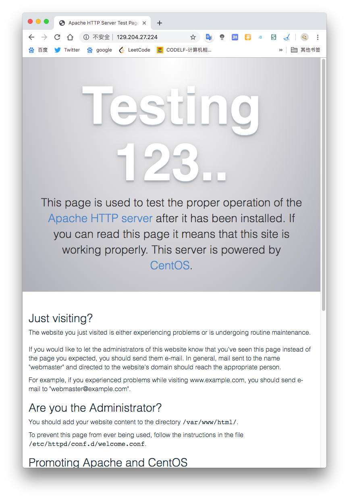
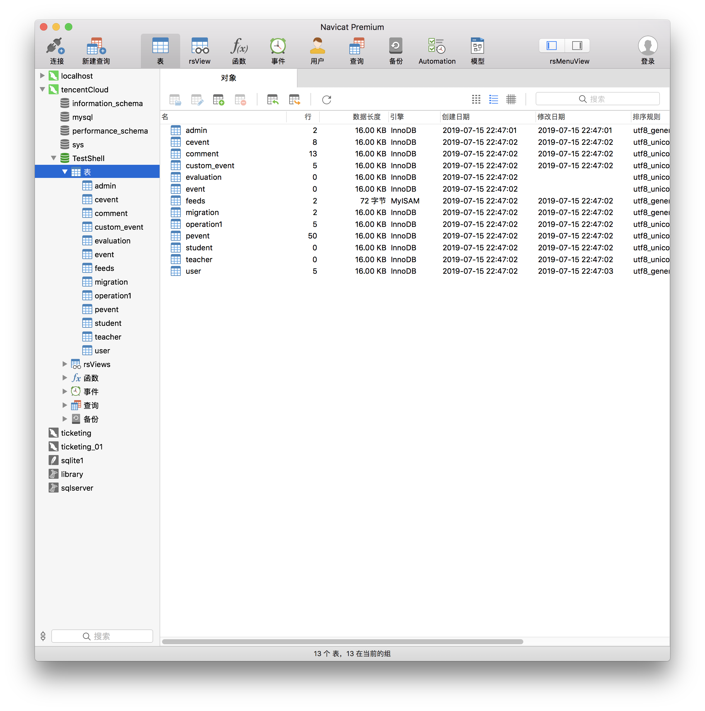

# 部署文档

> 作者: 李煦阳
>
> 邮箱: 1015545250@qq.com
>
> 部署服务器操作系统：centos7
>
> 项目地址：[前台链接](http://129.204.27.224/nku-calendar/frontend/web/index.php)，[后台链接](http://129.204.27.224/nku-calendar/backend/web/index.php?r=site)

## 一、环境需求

### 必要环境

- apache
- php
- mysql
- git
- composer

## 二、环境部署步骤

### 1. apache的安装

```shell
sudo yum install httpd
sudo systemctl enable httpd.service
sudo systemctl is-enabled httpd.service
# 观察到enabled,直接通过ip访问服务器，或看见apache默认欢迎页，则成功
```



关于apache的一些常用命令，在下面经常用到：

```shell
# 在服务器上启动 Apache 服务的命令为：
sudo systemctl start httpd.service
# 重新启动 Apache：
sudo systemctl restart httpd.service
# 停止 Apache：
sudo systemctl stop httpd.service
```

> 若在阿里云上，请先在服务器控制台开启相应接口

> 本项目未使用url美化规则，未使用虚拟域名，所以无需对apache配置进行更改，无需新建`.htaccess`文件

### 2. mysql的安装

```shell
sudo yum update
wget http://repo.mysql.com/mysql57-community-release-el7-8.noarch.rpm
sudo yum install mysql57-community-release-el7-8.noarch.rpm
sudo yum update
#### 若速度缓慢，可以再次出更改yum镜像源
sudo yum install mysql-server
```

更改yum镜像源的代码：

```shell
cd /etc/yum.repos.d 
mv CentOS-Base.repo CentOS-Base.repo.bk
wget http://mirrors.163.com/.help/CentOS6-Base-163.repo
# yum clean all
# yum update
yum makecache
```

### 3. mysql的配置

* [初始密码配置](<https://stackoverflow.com/questions/33510184/change-mysql-root-password-on-centos7>)（mysql version before 5.76）

  ```shell
  systemctl stop mysqld
  systemctl set-environment MYSQLD_OPTS="--skip-grant-tables"
  systemctl start mysqld
  mysql -u root
  mysql> UPDATE mysql.user SET authentication_string = PASSWORD('MyNewPassword')
      -> WHERE User = 'root' AND Host = 'localhost';
  mysql> FLUSH PRIVILEGES;
  mysql> quit
  systemctl stop mysqld
  systemctl unset-environment MYSQLD_OPTS
  systemctl start mysqld
  mysql -u root -p
  ```

* 远程访问配置

  ```shell
  use mysql
  # 若出现报错，初始密码配置未成功
  # set global validate_password_policy=0;
  # set password=password("MyNewPassword");
  # use mysql;
  mysql> update user set host = '%' where user = 'root'; 
  mysql> select host, user from user;
  FLUSH PRIVILEGES;
  ```

  此时即可通过mysql端口（默认3306）使用root账户从任意的ip访问该数据库

* [其他配置]((<https://www.jianshu.com/p/a482a0f8adfd>))：安全配置、自启；比较简单，见连接，未处理。

### 4. 安装php

  ```shell
rpm -Uvh https://mirror.webtatic.com/yum/el7/epel-release.rpm
rpm -Uvh https://mirror.webtatic.com/yum/el7/webtatic-release.rpm
yum install php71w php71w-cli php71w-common php71w-devel php71w-embedded php71w-fpm php71w-gd php71w-mbstring php71w-mysqlnd php71w-opcache php71w-pdo php71w-xml php71w-ldap php71w-mcrypt
service php-fpm start
  ```

### 5. 安装git，并进行全局配置

  ```shell
yum install git
git config --global user.name <myusername>
git config --global user.email <myemail>
# ...
  ```

### 6. composer安装，配置

```shell
curl -sS https://getcomposer.org/installer | php
mv composer.phar /usr/local/bin/composer
# composer -V
```

## 三、项目一般部署步骤

在配置好环境后，放在github上的项目一般要通过以下几个步骤进行部署。

* git clone 到web根目录
* 导入数据库文件
* 进行项目初始化php init
* 重写数据库配置
* 通过composer安装依赖

以上流程都是确定性的，所以我们使用一键部署脚本将五个操作合并

## 四、项目一键自动部署脚本分析

> 脚本名称：`start.sh`，放在项目根目录
>
> 脚本的调用方式为 `./start.sh <mysqluser> <mysqluserpassword>`

1. 对环境进行检查。（php, mysql）
2. 读取了输入的mysql用户参数与密码参数，将数据库建库文件重定向至mysql中。
3. 并调用init脚本，完成yii项目的必要文件的生成。
4. 根据mysql的用户名，密码，重写项目的main-local.php文件。
5. 检查composer是否安装，未安装则安装。并更改composer镜像。
6. 使用composer install, composer update下载依赖。

脚本内容：

```shell
#!/usr/bin/env bash
# Unsafe auto-deploy script.
if ! [ -x "$(command -v php)" ]; then
  echo 'Error: php is not installed.' >&2
  exit 1
fi

if ! [ -x "$(command -v mysql)" ]; then
  echo 'Error: mysql is not installed.' >&2
  exit 1
fi

user=root
password="default"
if [ -n "$1" ]; then
    user=$1
    echo Using mysql user: ${user}
else
    echo Using default mysql user: ${user}
fi

if [ -n "$2" ]; then
    password=$2
else
    echo Using empty password for user ${user}
fi

echo Initiating database: TestShell
cat ./db/sh_test.sql| mysql -u ${user} -p"${password}"

echo PHP INIT
php init

echo PROJECT CONFIGING

(
cat << EOF
return [
    'components' => [
        'db' => [
            'class' => 'yii\db\Connection',
            'dsn' => 'mysql:host=localhost;dbname=TestShell',
            'username' => '${user}',
            'password' => '${password}',
            'charset' => 'utf8',
        ],
        'mailer' => [
            'class' => 'yii\swiftmailer\Mailer',
            'viewPath' => '@common/mail',
            // send all mails to a file by default. You have to set
            // 'useFileTransport' to false and configure a transport
            // for the mailer to send real emails.
            'useFileTransport' => true,
        ],
    ],
];
EOF
) > ./common/config/main-local.php

if ! [ -x "$(command -v composer)" ]; then
    curl -sS https://getcomposer.org/installer | php
    mv composer.phar /usr/local/bin/composer
fi
# composer 全局安装

echo COMPOSER UPDATE
# 更改镜像源为aliyun
composer config -g repo.packagist composer https://mirrors.aliyun.com/composer/
# composer install
composer install -vvv
# composer update
composer update -vvv
```

> 应声明的是，改脚本读取密码的方式不够安全，对用户提示的方式还可以修改。
>
> 在部署过程中，由于composer update的速度缓慢，出现ssh断开的情况，所以又重新调用了composer install，composer update，完成对未成功下载的项目依赖的安装。

使用自动脚本自动创建数据库：

